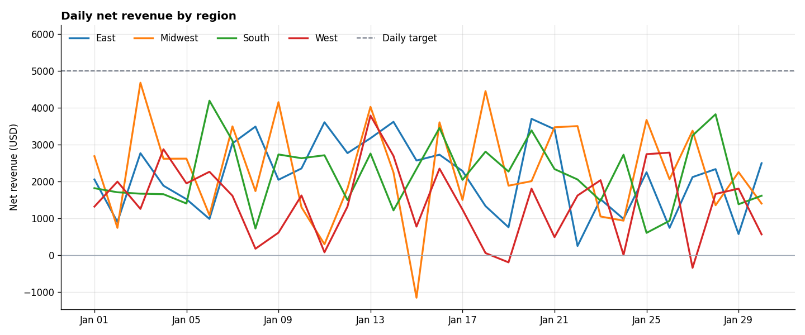

# BI Data Pipeline

Micro-batch ETL in Python and SQLite. It loads events from three sources, rejects bad rows with a logged reason, and produces a daily KPI table for BI tools.



## Results

Seed 42, 5,000 events, batch size 500.

| Measure | Value |
| --- | --- |
| Source events | 5,002 |
| Loaded | 5,000 |
| Rejected | 2 (1 duplicate ID, 1 unknown account) |
| Net revenue | $242,245 |

The two bad rows are planted on purpose so the rejection path is tested on every run.

## How it works

1. Generate three sources: events, accounts, and regional daily targets.
2. Read events in batches of 500.
3. For each batch: reject rows with a duplicate ID, an unknown account, an invalid event type, or a bad date or amount; join accounts and targets, and load into SQLite in one transaction.
4. Write rejected rows to `exceptions.csv` with the reason.
5. Aggregate `daily_kpis.csv` by date and region: events, purchases, net revenue, and target attainment.

## Run it

Python 3.9+. The pipeline uses only the standard library; charts need matplotlib.

```bash
python3 pipeline.py        # writes outputs/report/
python3 make_charts.py     # writes docs/daily_revenue.png
python3 -m unittest -v
```

`python3 pipeline.py --help` lists the batch size, event count, and seed options.

## Next steps

- Checkpoints so a failed run resumes from the last committed batch
- Scheduling and retries with Airflow
- Alerts when the rejection rate crosses a threshold
